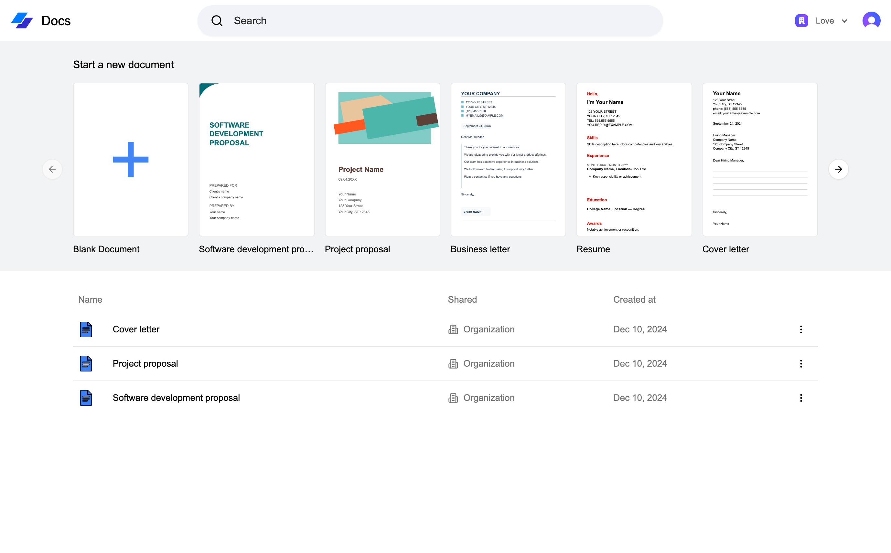
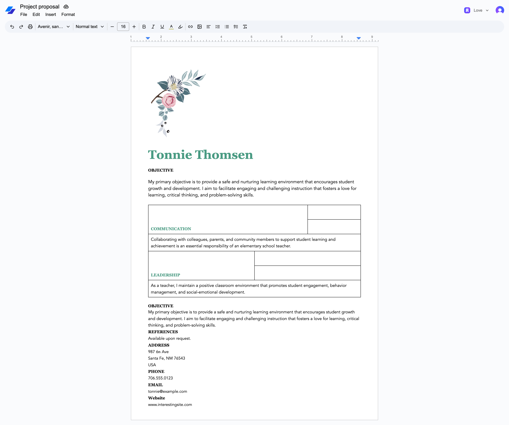

# Text documents fullstack management using Vue.js, Tailwind, Shadcn, Convex

[Live app](https://documents-seven-dun.vercel.app)

[Video](https://shorturl.at/UZ9Qu)

Features:

- Tailwind CSS Design: Utilizes a modern and customizable utility-first CSS framework for streamlined and aesthetic UI.
- Fully Responsive: Ensures seamless functionality and design across all devices and screen sizes.
- ShadCN Component Library: Leverages pre-built, accessible, and highly customizable UI components for faster development.
- Convex for Data Operations: Handles complex data manipulation and real-time display with robust backend capabilities.
- Authentication: Implements Clerk for user authentication.
- Organizations: Includes the ability to create, edit, delete, and invite members to organizations.
- Document Management: Includes the ability to create, edit, delete, and invite members.
- Features for creating, editing, and deleting documents.
- Tiptap editor.
- Reactive Data Management: Automates data updates without requiring manual code refetching, improving development efficiency.

